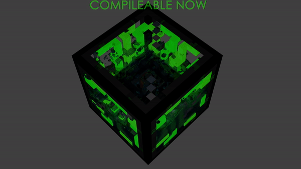

  

# Applied Energistics 3

This repository is a WIP on Applied Energistics 3 - ReOver.

## All contributions are welcome

Whether you would like to help us develop AE3 directly, by coding and modelling, or simply report bugs you find and share what's going on here with your friends, all your contributions, small and big, are welcome.

If you're willing to be part of AE3, start by [joining our discord server](https://discord.gg/bwq3k79). This is where most activity, news and everything happens.

If you want to go further and commit to AE3 progress, start by [looking at our TO-DOs](https://github.com/AEModernMCPort/Applied-Energistics-3-ReOver/issues?q=is%3Aissue+is%3Aopen+label%3A%22Type%3A+TODO%22), or if you don't want to do any of that, ask on discord for what should be done. Next, [fork the repo](https://github.com/AEModernMCPort/Applied-Energistics-3-ReOver#fork-destination-box), do whatever is needed and [PR them back](https://github.com/AEModernMCPort/Applied-Energistics-3-ReOver/compare)!
In case you don't understand how something in AE3 works, [take a look at our docs](https://aemodernmcport.gitbooks.io/applied-energistics-3-docs/), and if you don't find what you want there, ask us on discord!

Speaking of documentation, if you took a look at it, you have probably noticed how empty (at the moment of writing this README) it is. If you have good understading of AE3, contributions to documentation are welcome too, and you can find [docs github repository here](https://github.com/AEModernMCPort/Applied-Energistics-3-Docs).
